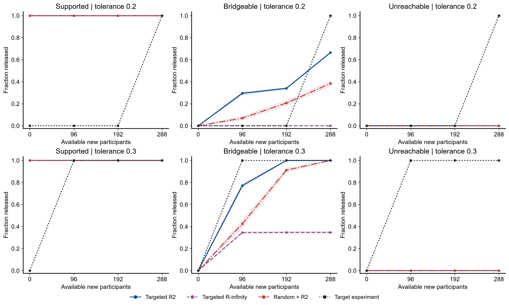
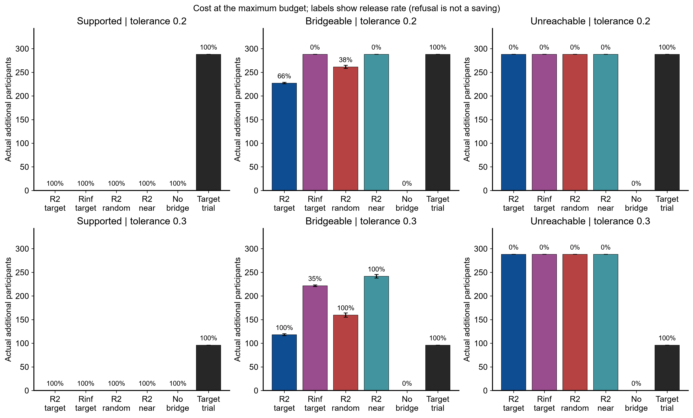

# 完整流程实验结果

配置：workflow_full。共 1800 个独立世界，3 个二维效应函数 × 3 类支持几何；每个世界 6 种策略、2 个预先固定容忍度配对比较。

这次实际模拟了联合机制审计、历史随机试验、拒绝、采集桥接试验两臂观测、重新估计及首次发布后的停止。输出没有把未采集候选或目标真值输入规划器。

## 1. 同一预算下，发布与成本必须一起读

表中 released 是累计发布率；new_n 是实际额外受试者，最多 288 人；path_covered 是该方法截至该预算全部实际输出同时覆盖真值的比例。按三个函数等权汇总；各函数结果另存 workflow_summary.csv。

### 容忍度 0.2

| scenario | method | released | new_n | bad_release | path_covered | released_mae |
| --- | --- | --- | --- | --- | --- | --- |
| bridgeable | r2_nearest | 0.0000 | 288.0000 | 0.0000 | 1.0000 | — |
| bridgeable | r2_random | 0.3850 | 261.4400 | 0.0000 | 1.0000 | 0.0330 |
| bridgeable | r2_static | 0.0000 | 0.0000 | 0.0000 | 1.0000 | — |
| bridgeable | r2_targeted | 0.6650 | 227.0400 | 0.0000 | 1.0000 | 0.0358 |
| bridgeable | rinf_targeted | 0.0000 | 288.0000 | 0.0000 | 1.0000 | — |
| bridgeable | target_only | 1.0000 | 288.0000 | 0.0000 | 0.9983 | 0.0482 |
| supported | r2_nearest | 1.0000 | 0.0000 | 0.0000 | 1.0000 | 0.0153 |
| supported | r2_random | 1.0000 | 0.0000 | 0.0000 | 1.0000 | 0.0153 |
| supported | r2_static | 1.0000 | 0.0000 | 0.0000 | 1.0000 | 0.0153 |
| supported | r2_targeted | 1.0000 | 0.0000 | 0.0000 | 1.0000 | 0.0153 |
| supported | rinf_targeted | 1.0000 | 0.0000 | 0.0000 | 1.0000 | 0.0192 |
| supported | target_only | 1.0000 | 288.0000 | 0.0050 | 0.9850 | 0.0477 |
| unreachable | r2_nearest | 0.0000 | 288.0000 | 0.0000 | 1.0000 | — |
| unreachable | r2_random | 0.0000 | 288.0000 | 0.0000 | 1.0000 | — |
| unreachable | r2_static | 0.0000 | 0.0000 | 0.0000 | 1.0000 | — |
| unreachable | r2_targeted | 0.0000 | 288.0000 | 0.0000 | 1.0000 | — |
| unreachable | rinf_targeted | 0.0000 | 288.0000 | 0.0000 | 1.0000 | — |
| unreachable | target_only | 1.0000 | 288.0000 | 0.0000 | 0.9950 | 0.0447 |

### 容忍度 0.3

| scenario | method | released | new_n | bad_release | path_covered | released_mae |
| --- | --- | --- | --- | --- | --- | --- |
| bridgeable | r2_nearest | 1.0000 | 241.6000 | 0.0000 | 1.0000 | 0.0471 |
| bridgeable | r2_random | 1.0000 | 159.6800 | 0.0000 | 1.0000 | 0.0399 |
| bridgeable | r2_static | 0.0000 | 0.0000 | 0.0000 | 1.0000 | — |
| bridgeable | r2_targeted | 1.0000 | 117.9200 | 0.0000 | 1.0000 | 0.0396 |
| bridgeable | rinf_targeted | 0.3467 | 221.6000 | 0.0000 | 1.0000 | 0.0348 |
| bridgeable | target_only | 1.0000 | 96.0000 | 0.0017 | 0.9983 | 0.0787 |
| supported | r2_nearest | 1.0000 | 0.0000 | 0.0000 | 1.0000 | 0.0153 |
| supported | r2_random | 1.0000 | 0.0000 | 0.0000 | 1.0000 | 0.0153 |
| supported | r2_static | 1.0000 | 0.0000 | 0.0000 | 1.0000 | 0.0153 |
| supported | r2_targeted | 1.0000 | 0.0000 | 0.0000 | 1.0000 | 0.0153 |
| supported | rinf_targeted | 1.0000 | 0.0000 | 0.0000 | 1.0000 | 0.0192 |
| supported | target_only | 1.0000 | 96.0000 | 0.0017 | 0.9967 | 0.0844 |
| unreachable | r2_nearest | 0.0000 | 288.0000 | 0.0000 | 1.0000 | — |
| unreachable | r2_random | 0.0000 | 288.0000 | 0.0000 | 1.0000 | — |
| unreachable | r2_static | 0.0000 | 0.0000 | 0.0000 | 1.0000 | — |
| unreachable | r2_targeted | 0.0000 | 288.0000 | 0.0000 | 1.0000 | — |
| unreachable | rinf_targeted | 0.0000 | 288.0000 | 0.0000 | 1.0000 | — |
| unreachable | target_only | 1.0000 | 96.0000 | 0.0017 | 0.9983 | 0.0793 |

## 2. 一个完整轨迹（固定选择 linear / bridgeable / replicate=0）

此例按索引固定展示，不按成功与否挑选；发布后的预算行仅结转既有结果，不继续收集数据。

| budget | selected | estimate | radius | released | new_n | refusal_lower | refusal_upper | path_covered |
| --- | --- | --- | --- | --- | --- | --- | --- | --- |
| 0 | [] | -0.4605 | 0.5831 | False | 0 | -1.0516 | 0.1591 | True |
| 1 | [9] | -0.0336 | 0.2058 | False | 96 | -0.4938 | 0.1591 | True |
| 2 | [9, 8] | -0.0087 | 0.1687 | True | 192 | -0.3556 | 0.1591 | True |
| 3 | [9, 8] | -0.0087 | 0.1687 | True | 192 | -0.3556 | 0.1591 | True |

## 3. 配对比较：不把不同方法当独立样本

以下为 targeted R2 减去比较方法，最终预算 288 人；released 为正意味着更多发布，new_n 为负意味着实际采集更少。成本优势必须同时检查发布率；无桥接方法零成本并不意味着完成了任务。95% 区间来自按世界配对、按函数分层的 bootstrap，非多重比较调整后的确认性区间。

| scenario | tolerance | comparator | metric | targeted_minus_comparator | lower | upper |
| --- | --- | --- | --- | --- | --- | --- |
| bridgeable | 0.2000 | rinf_targeted | released | 0.6650 | 0.6617 | 0.6667 |
| bridgeable | 0.2000 | rinf_targeted | new_n | -60.9600 | -62.4000 | -59.3600 |
| bridgeable | 0.2000 | r2_random | released | 0.2800 | 0.2550 | 0.3050 |
| bridgeable | 0.2000 | r2_random | new_n | -34.4000 | -37.9200 | -30.7200 |
| bridgeable | 0.2000 | r2_nearest | released | 0.6650 | 0.6617 | 0.6667 |
| bridgeable | 0.2000 | r2_nearest | new_n | -60.9600 | -62.4000 | -59.3600 |
| bridgeable | 0.2000 | r2_static | released | 0.6650 | 0.6617 | 0.6667 |
| bridgeable | 0.2000 | r2_static | new_n | 227.0400 | 225.6000 | 228.6400 |
| bridgeable | 0.2000 | target_only | released | -0.3350 | -0.3383 | -0.3333 |
| bridgeable | 0.2000 | target_only | new_n | -60.9600 | -62.4000 | -59.3600 |
| bridgeable | 0.3000 | rinf_targeted | released | 0.6533 | 0.6433 | 0.6617 |
| bridgeable | 0.3000 | rinf_targeted | new_n | -103.6800 | -106.2400 | -100.9600 |
| bridgeable | 0.3000 | r2_random | released | 0.0000 | 0.0000 | 0.0000 |
| bridgeable | 0.3000 | r2_random | new_n | -41.7600 | -46.2400 | -37.4400 |
| bridgeable | 0.3000 | r2_nearest | released | 0.0000 | 0.0000 | 0.0000 |
| bridgeable | 0.3000 | r2_nearest | new_n | -123.6800 | -128.0000 | -119.2000 |
| bridgeable | 0.3000 | r2_static | released | 1.0000 | 1.0000 | 1.0000 |
| bridgeable | 0.3000 | r2_static | new_n | 117.9200 | 115.8400 | 120.0000 |
| bridgeable | 0.3000 | target_only | released | 0.0000 | 0.0000 | 0.0000 |
| bridgeable | 0.3000 | target_only | new_n | 21.9200 | 19.8400 | 24.0000 |
| supported | 0.2000 | rinf_targeted | released | 0.0000 | 0.0000 | 0.0000 |
| supported | 0.2000 | rinf_targeted | new_n | 0.0000 | 0.0000 | 0.0000 |
| supported | 0.2000 | r2_random | released | 0.0000 | 0.0000 | 0.0000 |
| supported | 0.2000 | r2_random | new_n | 0.0000 | 0.0000 | 0.0000 |
| supported | 0.2000 | r2_nearest | released | 0.0000 | 0.0000 | 0.0000 |
| supported | 0.2000 | r2_nearest | new_n | 0.0000 | 0.0000 | 0.0000 |
| supported | 0.2000 | r2_static | released | 0.0000 | 0.0000 | 0.0000 |
| supported | 0.2000 | r2_static | new_n | 0.0000 | 0.0000 | 0.0000 |
| supported | 0.2000 | target_only | released | 0.0000 | 0.0000 | 0.0000 |
| supported | 0.2000 | target_only | new_n | -288.0000 | -288.0000 | -288.0000 |
| supported | 0.3000 | rinf_targeted | released | 0.0000 | 0.0000 | 0.0000 |
| supported | 0.3000 | rinf_targeted | new_n | 0.0000 | 0.0000 | 0.0000 |
| supported | 0.3000 | r2_random | released | 0.0000 | 0.0000 | 0.0000 |
| supported | 0.3000 | r2_random | new_n | 0.0000 | 0.0000 | 0.0000 |
| supported | 0.3000 | r2_nearest | released | 0.0000 | 0.0000 | 0.0000 |
| supported | 0.3000 | r2_nearest | new_n | 0.0000 | 0.0000 | 0.0000 |
| supported | 0.3000 | r2_static | released | 0.0000 | 0.0000 | 0.0000 |
| supported | 0.3000 | r2_static | new_n | 0.0000 | 0.0000 | 0.0000 |
| supported | 0.3000 | target_only | released | 0.0000 | 0.0000 | 0.0000 |
| supported | 0.3000 | target_only | new_n | -96.0000 | -96.0000 | -96.0000 |
| unreachable | 0.2000 | rinf_targeted | released | 0.0000 | 0.0000 | 0.0000 |
| unreachable | 0.2000 | rinf_targeted | new_n | 0.0000 | 0.0000 | 0.0000 |
| unreachable | 0.2000 | r2_random | released | 0.0000 | 0.0000 | 0.0000 |
| unreachable | 0.2000 | r2_random | new_n | 0.0000 | 0.0000 | 0.0000 |
| unreachable | 0.2000 | r2_nearest | released | 0.0000 | 0.0000 | 0.0000 |
| unreachable | 0.2000 | r2_nearest | new_n | 0.0000 | 0.0000 | 0.0000 |
| unreachable | 0.2000 | r2_static | released | 0.0000 | 0.0000 | 0.0000 |
| unreachable | 0.2000 | r2_static | new_n | 288.0000 | 288.0000 | 288.0000 |
| unreachable | 0.2000 | target_only | released | -1.0000 | -1.0000 | -1.0000 |
| unreachable | 0.2000 | target_only | new_n | 0.0000 | 0.0000 | 0.0000 |
| unreachable | 0.3000 | rinf_targeted | released | 0.0000 | 0.0000 | 0.0000 |
| unreachable | 0.3000 | rinf_targeted | new_n | 0.0000 | 0.0000 | 0.0000 |
| unreachable | 0.3000 | r2_random | released | 0.0000 | 0.0000 | 0.0000 |
| unreachable | 0.3000 | r2_random | new_n | 0.0000 | 0.0000 | 0.0000 |
| unreachable | 0.3000 | r2_nearest | released | 0.0000 | 0.0000 | 0.0000 |
| unreachable | 0.3000 | r2_nearest | new_n | 0.0000 | 0.0000 | 0.0000 |
| unreachable | 0.3000 | r2_static | released | 0.0000 | 0.0000 | 0.0000 |
| unreachable | 0.3000 | r2_static | new_n | 288.0000 | 288.0000 | 288.0000 |
| unreachable | 0.3000 | target_only | released | -1.0000 | -1.0000 | -1.0000 |
| unreachable | 0.3000 | target_only | new_n | 192.0000 | 192.0000 | 192.0000 |

## 4. 覆盖与软件验收

- 联合机制集合覆盖：0.9489，声明下界 .95（有限模拟存在波动）。
- 各独立单元×方法×阈值的完整路径经验覆盖最小值：0.9750；声明下界 .90。
- 各单元无条件错误发布率最大值：0.0100。
- 正确性及统计验收：21/21 通过。统计检验不拒绝并不证明前提成立；保证来自协议中的联合事件推导。
- 实际路径的 SLSQP 起点失败数：0；所有结果均为可行上界，不是全局最优声明。所有候选求解器诊断另见 candidate_scores.csv。

R∞ 在完整候选库上建立一次噪声事件；R2 为加权区间的 4 轮检查和拒绝外区间分配预算。target-only 无需机制校准，用相同总失败预算 .10 分配给 3 个累计试验。没有把每轮 90% 当成整条路径 90%。

## 5. 怎样解释正面和负面结果

- supported 测试旧档案能否避免无必要新增试验；bridgeable 测试新来源能否填补支持；unreachable 检验给定候选菜单的边界。
- 若 targeted R2 的配对成本区间全小于零且发布率未下降，才有支持节约新增实验的证据；这不是所有方法/场景的统一优越性结论。
- R∞ 更保守或发布更少不构成代码失败；它允许更广的选权方式，而本轮 R2 的策略严格按设计规划。
- 若直接重做目标更有效，应据此建议直接实验，不能隐藏该基线。
- 已覆盖的宽区间、无限区间及拒绝都不能单独作为有效性的胜利；图表并列展示发布与成本。

## 6. 这轮完成了什么、没有完成什么

完成了可重跑的二维完整合成流程和真实生成的新随机实验观测；没有执行 Many Labs 等真实数据上的机制集合校准。校准标签、解析 L/H、已知 Gaussian 噪声、候选实验菜单和统一受试者成本是明确的模拟前提。未包含机制审计的共同前置成本，也未比较不同试验的部署成本。

半径使用球集合的 sup G 外上界，并与逐源 Lipschitz 因果误差界取较小值。这是同一机制覆盖事件上的有效收紧；后者不必上界 G，不称为论文 B_U 的精确求解。方法名 R2/R∞ 指其噪声控制形式。桥接按下一轮证书半径作逐步数值选择，不宣称 PI sharpness、桥接全局最优或次模保证。有限预算联合界也不是无限时域或任意 outcome-adaptive 政策保证。

数据入口：workflow_records.csv（含停止后的预算结转）、acquisitions.csv（真正采集的两臂摘要）、plans.jsonl（无结果规划）、world_audits.jsonl（评分后公开真值与校准信息）、paired_comparisons.csv、statistical_calibration_checks.csv。

